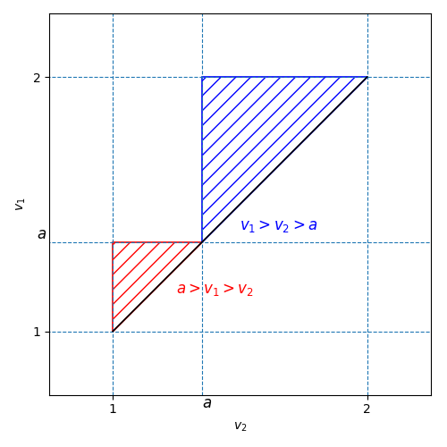

### Solution

Consider without the loss of generality that $v_1 > v_2$. We can separate the problem into 3 cases:

- $u > v > a$ - the second car has to slow down to $a$.
- $u > a > v$ - there is no distance loss.
- $a > u > v$ - the second car has to stop.

We know that the problem domain is given by $u,v \sim \mathcal{U}(1,2)$. So it can be visualised by:

The distance loss is non-zero only on the colored parts. Now suppose that $v_1 > v_2 > v_3$. Lets calculate the distance loss given by the process of slowing down from $v_2$ to $v_3$ with acceleration $a_\mathrm{acc}$.

We slow down from $v_2$ to $v_3$ with $a_\mathrm{acc}$, which means:

$$
v_2 - at_s = v_3 \implies t_s = \frac{v_2 - v_3}{a_\mathrm{acc}}.
$$

The $u > v > a$ yields $t_\mathrm{FAST} = \frac{v - a}{a_\mathrm{acc}}$ and the case $a > u > v$ becomes $t_\mathrm{SLOW} = \frac{v}{a_\mathrm{acc}}$. The distance lost is a triangle, so its area is given by (substituting $a_\mathrm{acc}=1$):

$$
D = \frac{1}{2} \cdot 2t_i \cdot \Delta V \implies
\begin{cases}
    D_\mathrm{FAST} = \frac{(v - a)^2}{a_\mathrm{acc}} = (v - a)^2 \\
    D_\mathrm{SLOW} = \frac{v^2}{a_\mathrm{acc}} = v^2
\end{cases}.
$$

Now lets calculate the density of cars given some speed $v$. By Little's Law it is $\rho(v) = z\frac{N}{v}$, where $z$ is the density given in the exercise and $N$ is the length of one car trip, therefore $\frac{N}{V}$ is the time it takes car with velocity $v$ to complete the trip. Given speeds $u > v$, the closing speed is given by $u - v$. Using this we can calculate the expected time the slower car has to slow down to let faster one pass. Given time slice of $\Delta t$, the fast car will catch up to the slow car if it is at most $(u - v)\Delta t$ behind the slow car. The number of faster cars on this interval is given by $\rho(u)$, so the expected passes are proportional to:

$$
\rho(u)(u - v)\Delta t,
$$

which divided by $\Delta t$ yields the rate of overtakes. We can now formulate the first integral. The expected number of times a $v$-car is overtaken during the trip of the length $\frac{N}{v}$ is equal to:

$$
\begin{split}
    \mathbb{E}\Big[\text{overtakes} \Big \vert v \Big] &= \frac{N}{v} \int_{u>v,v \text{ in the same lane}} \rho(u)(u-v) du \\
    &= zN^2 v \int_{u>v,v \text{ in the same lane}} \frac{u - v}{u} du.
\end{split}
$$

The $zN^2$ is independent of the integral and it scales the integral by the same value independently of the value of $a$, so we can skip it when optimizing. We can define the value of the integral as some kernel function $K(v, b)$:

$$
K(v, b) = \int_{u=v}^b \frac{u - v}{u} du = (b - v) + v \ln{\frac{v}{b}}.
$$

When plugging $b = a$ we get the kernel for slow lane interactions, and when plugging $b = 2$, we get the fast lane interactions.
Now we can calculate the corresponding contributions. For the slow lane we get:

$$
J_\mathrm{SLOW}(a) = \int_1^a v^2 \frac{1}{v} K(v, a) dv = \int_1^a v\Big[(a - v) + v \ln{\frac{v}{a}} \Big] dv = \frac{a^3}{18} - \frac{a}{2} + \frac{4}{9} + \frac{1}{3} \Big( \ln{\frac{a}{2}} + \ln{2} \Big).
$$

For the fast lane:

$$
J_\mathrm{FAST}(a) = \int_a^2 \frac{(v - a) ^ 2}{v} K(v, a) dv = \int_a^2 \frac{(v - a) ^ 2}{v} \Big[(2 - v) + v \ln{\frac{v}{2}} \Big] dv = \frac{17a^3}{18} - a^2 - 2a + \frac{4}{9} + \ln{\frac{a}{2}} \Big(4a^2 - 4a + \frac{8}{3} \Big).
$$

Total objective function is given by:

$$
J(a) = J_\mathrm{SLOW}(a) + J_\mathrm{FAST}(a) = a^3 - a^2 - \frac{5}{2}a + \frac{8}{9} + \frac{1}{3} \ln{2} + \ln{\frac{a}{2}} \Big(4a^2 - 4a + 3 \Big).
$$

Finding the minimum using derivatives yields:

$$
(J(a))' = 3a^2 + 2a + \frac{3}{a} + 8a\ln{\frac{a}{2}} - 4\ln{a} - \frac{13}{2} + \ln{16} = 0 \implies a \approx 1.21787999727349...
$$
